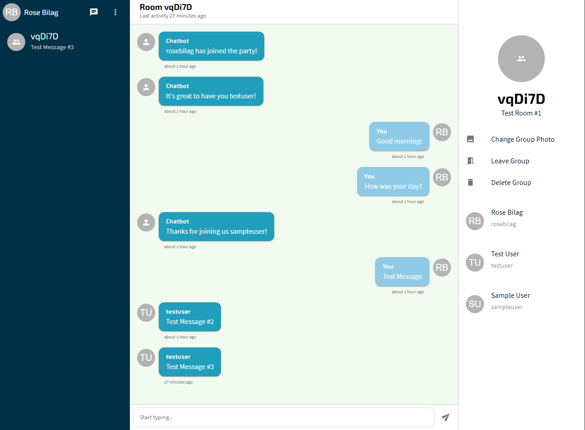
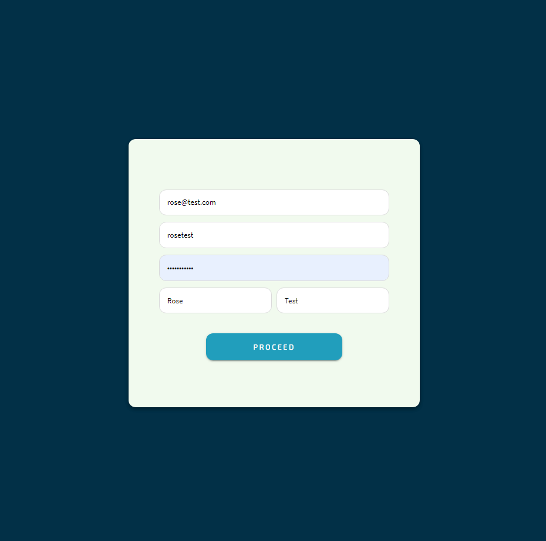
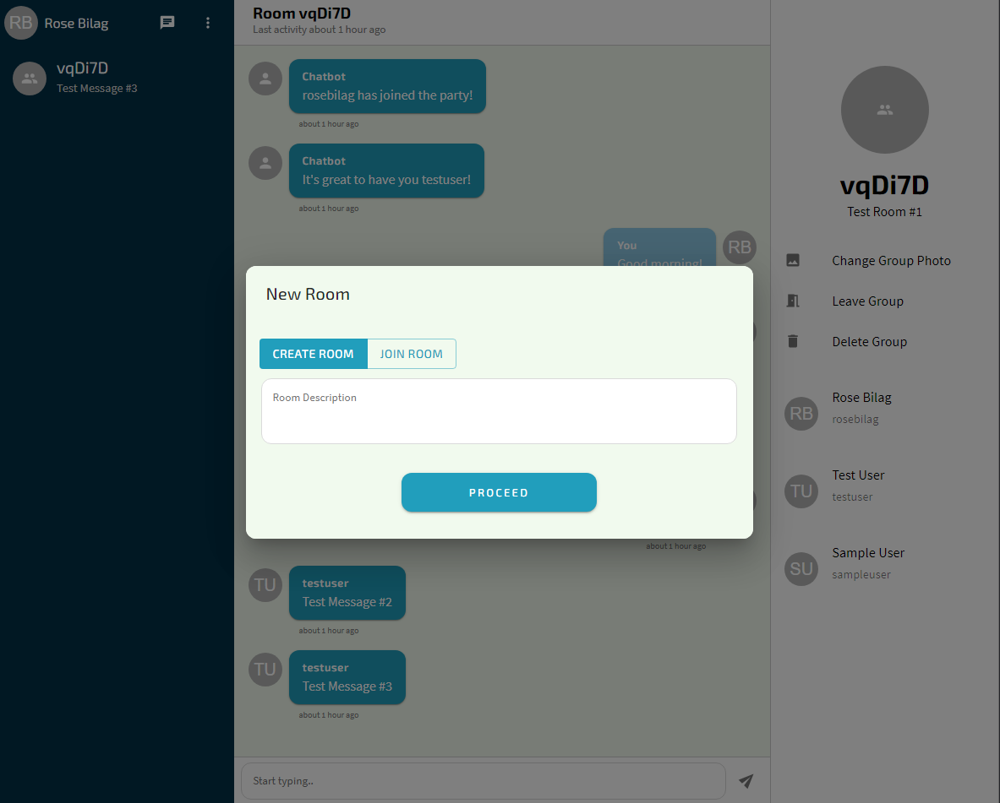
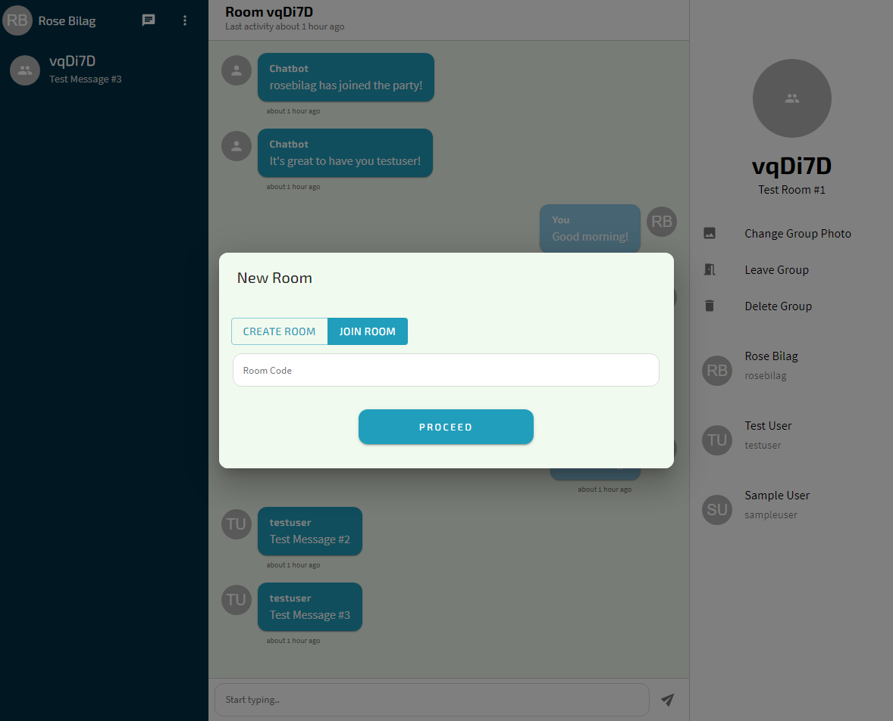

[![Netlify Status][netlify-shield]][netlify-url]

<br />
<p align="center">
  <h1 align="center">Realtime Chat App</h1>
  
  <p align="center">
    A web-based messaging application that delivers messages instantaneously.
    <br /><br />
    <a href="https://rose-chat-client.netlify.app"><strong>View Live Demo »</strong></a>
    <br /><br />
    <a href="https://www.youtube.com/watch?v=IGGCznKBlxk"><strong>View Video Demo »</strong></a>
    <br /><br />
    <a href="https://github.com/crookedfingerworks/chat-frontend/issues">Report Bug</a>
    ·
    <a href="https://github.com/crookedfingerworks/chat-frontend/issues">Request Feature</a>
  </p>
</p>

<h2 style="display: inline-block">Table of Contents</h2>
<ol>
  <li>
    <a href="#about-the-project">About The Project</a>
    <ul>
      <li><a href="#built-with">Built With</a></li>
    </ul>
  </li>
  <li>
    <a href="#getting-started">Getting Started</a>
    <ul>
      <li><a href="#prerequisites">Prerequisites</a></li>
      <li><a href="#installation">Installation</a></li>
    </ul>
  </li>
  <li><a href="#usage">Usage</a></li>
  <li><a href="#implementation-pipeline">Implementation Pipeline</a></li>
  <li><a href="#contact">Contact</a></li>
</ol>

## About The Project

### Built With

- **[React](https://reactjs.org/)**
- **[Socket.io](https://socket.io/)**
- **[Typescript](https://www.typescriptlang.org/)**
- [Node.js](https://nodejs.org/en/)
- [MongoDB](https://www.mongodb.com/)

## Getting Started

To get a local copy up and running follow these simple steps.

### Prerequisites

Install latest version of npm

- npm
  ```sh
  npm install npm@latest -g
  ```

### Installation

1. Clone the project
   ```sh
   git clone https://github.com/crookedfingerworks/chat-frontend.git
   ```
2. Go to project directory and Install NPM packages
   ```sh
   npm install
   ```
3. Create .env file with the ff. content
   ```sh
   REACT_APP_SERVER_URL=https://rose-chat-backend.herokuapp.com
   ```
4. Start the application
   ```sh
   npm start
   ```

## Usage

**Creating an Account**



1. In the login page, click 'Register here'.
2. Input the necessary fields. Don't worry. It won't take long.
3. You'll be redirected to the login page. Enter your newly created credentials.

**Creating a Room**



1. Click the message icon on the sidebar header.
2. Input the necessary fields and proceed.
3. Share the randomly-generated room code with people you want to invite in the room.

**Joining a Room**



1. Obtain the room code from the room creator.
2. Click the message icon on the sidebar header.
3. Click 'Join Room' tab option.
4. Input room code and proceed.

## Implementation Pipeline

<ol>
    <li>Upload Group Image</li>
    <li>"User is typing" indicator</li>
    <li>Emoticons</li>
</ol>

## Contact

crooked.finger.works@gmail.com

Project Link: [https://github.com/crookedfingerworks/chat-frontend](https://github.com/crookedfingerworks/chat-frontend)

[netlify-shield]: https://img.shields.io/netlify/24e36167-88a7-4e1e-93f5-0986aa1c1b7d?style=for-the-badge
[netlify-url]: https://app.netlify.com/sites/rose-chat-client/deploys
